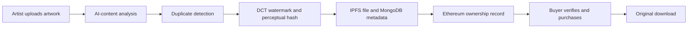
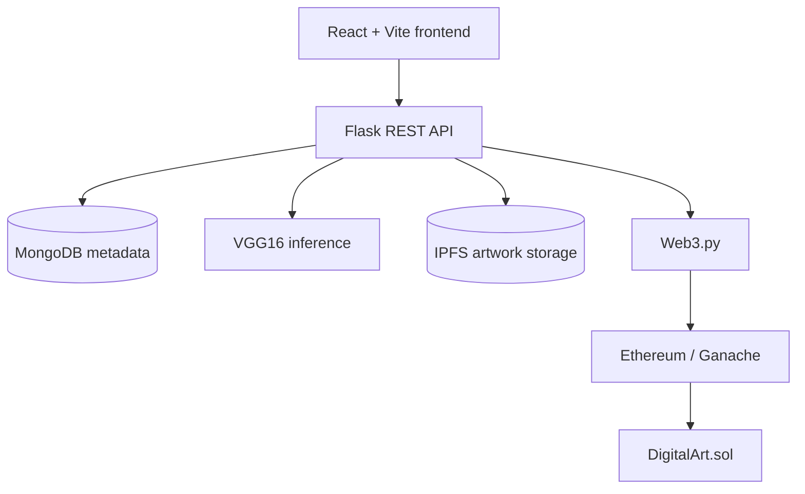

<div align="center">


# Digital Art Protection

### AI-assisted provenance, watermarking, and blockchain ownership for digital artwork


**Protect the artwork. Prove the origin. Verify the owner.**

</div>

Digital Art Protection is a full-stack provenance platform for artists and buyers. It combines AI-assisted artwork analysis, imperceptible watermarking, duplicate detection, decentralized storage, and blockchain ownership records into one practical workflow.

<div align="center">

| Analyze | Protect | Register | Verify |
| :---: | :---: | :---: | :---: |
| AI-content signal | DCT watermark | Ethereum record | Ownership check |

</div>

## Project Snapshot

| | |
| --- | --- |
| **Project type** | Full-stack portfolio and research application |
| **Primary users** | Digital artists, buyers, and administrators |
| **Core problem** | Artwork provenance, duplication, and ownership verification |
| **Main workflow** | Analyze -> protect -> store -> register -> verify |
| **Local services** | React, Flask, MongoDB, IPFS, and Ganache |

## What I Built

| | |
| --- | --- |
| **Full-stack integration** | Connected a React client, Flask REST API, ML inference, IPFS storage, MongoDB metadata, and an Ethereum smart contract. |
| **Digital protection** | Applied DCT watermarking and perceptual hashing for provenance checks and duplicate detection. |
| **Authorization** | Built separate artist and buyer experiences with JWT authentication, route guards, and backend role enforcement. |
| **ML pipeline** | Structured VGG16 training, validation, and inference as separate reproducible modules. |
| **Quality** | Added backend API tests and Playwright browser-flow tests for the core user journey. |

## Contents

- [Recruiter View](#recruiter-view)
- [Product Workflow](#product-workflow)
- [Key Capabilities](#key-capabilities)
- [Architecture](#architecture)
- [Technology Stack](#technology-stack)
- [Repository Structure](#repository-structure)
- [Quick Start](#quick-start)
- [Testing](#testing)
- [Security Notes](#security-notes)

## Recruiter View

This project demonstrates practical full-stack engineering across several boundaries:

| Capability | Evidence in the project |
| --- | --- |
| **Frontend engineering** | React screens, protected routes, wallet-aware purchase flow, and browser tests |
| **Backend engineering** | Flask blueprints, JWT authentication, role authorization, file handling, and API tests |
| **Applied machine learning** | VGG16 training workflow and inference service for artwork classification |
| **Web3 integration** | Solidity contract deployment, Web3.py transactions, ethers.js client integration |
| **Data and media systems** | MongoDB metadata, IPFS content storage, DCT watermarking, and perceptual hashing |

The application is designed for local demonstration with Docker Compose, Ganache, IPFS, MongoDB, Flask, and Vite.

## Product Workflow



## Key Capabilities

| Area | Capability |
| --- | --- |
| Artist experience | Role-based registration, artwork upload, ownership management |
| AI analysis | VGG16-based classifier for AI-generated versus human-created artwork |
| Image protection | DCT watermarking and perceptual hashing for provenance and duplicate detection |
| Decentralized storage | IPFS-backed artwork storage with content identifiers |
| Blockchain | Solidity registry for ownership and purchase records |
| Buyer experience | Watermarked gallery, ownership verification, purchase flow, original download |
| API security | Flask blueprints, JWT authentication, role-aware backend authorization |
| Local development | Docker Compose services for MongoDB, Ganache, and IPFS |

## Architecture



## Technology Stack

- **Frontend:** React, Vite, ethers.js
- **Backend:** Python, Flask, Flask-JWT-Extended, PyMongo, Web3.py
- **Machine learning:** TensorFlow, Keras, VGG16
- **Image processing:** DCT watermarking, perceptual hashing
- **Blockchain:** Solidity, Hardhat, Ganache
- **Storage:** MongoDB and IPFS
- **Testing:** Pytest and Playwright
- **Environment:** Docker Compose, Python 3.12, Node.js

## Repository Structure

```text
backend/           Flask API, authentication, artwork and admin blueprints
blockchain/        Solidity contract, Hardhat configuration and deployments
frontend/          React client and Playwright end-to-end tests
ml_model/          VGG16 training data, training script and inference service
steganography/     Watermarking and perceptual hashing utilities
docker-compose.yml Local MongoDB, Ganache and IPFS services
```

<details>
<summary><strong>Quick Start: run the project locally</strong></summary>

## Quick Start

### Prerequisites

- Docker Desktop
- Python 3.12
- Node.js and npm
- A local Ganache account for development transactions

### 1. Start infrastructure

From the project root:

```powershell
docker compose up -d mongodb ganache ipfs
```

Keep the `ganache-data` Docker volume between restarts. Removing it resets the local chain and can invalidate existing blockchain references stored in MongoDB.

### 2. Deploy the smart contract

```powershell
cd blockchain
npm install
npm run deploy:ganache
```

The local Ganache network uses chain ID `1337` at `http://127.0.0.1:7545`. Deployment details are written to `blockchain/deployments/ganache.json`.

### 3. Configure and start the API

```powershell
cd ..\backend
Copy-Item ..\.env.example .env
py -3.12 -m venv .venv
.\.venv\Scripts\Activate.ps1
python -m pip install -r requirements.txt
```

Set the local Ganache private key and deployed contract address in `backend/.env`, then start Flask:

```powershell
flask --app app run --debug --port 5000
```

Health check: `http://localhost:5000/health`

### 4. Start the frontend

```powershell
cd ..\frontend
Copy-Item .env.example .env
npm install
npm run dev
```

Open the Vite URL shown in the terminal, normally `http://localhost:5173`.

### 5. Prepare the AI detector

Place labeled images in the training and validation folders:

```text
ml_model/data/train/Human
ml_model/data/train/AI
ml_model/data/validation/Human
ml_model/data/validation/AI
```

Install the ML dependencies and train the model:

```powershell
cd ..\ml_model
py -3.12 -m venv .venv
.\.venv\Scripts\Activate.ps1
python -m pip install -r requirements.txt
python -m training.train --data-dir data --output vgg16_ai_detector.h5 --epochs 10
```

The generated model must be saved as `ml_model/vgg16_ai_detector.h5` before upload analysis can run.

</details>

## Testing

Run backend tests from `backend/`:

```powershell
pytest
```

Run frontend end-to-end tests from `frontend/`:

```powershell
npm install
npx playwright test
```

## Security Notes

- Never commit `.env` files, private keys, or production secrets.
- Use development Ganache accounts only on the local chain.
- Replace Flask, JWT, RPC, contract, and wallet values through a secret manager before production use.

## Project Status

This repository is a portfolio and research project demonstrating how AI analysis, digital watermarking, decentralized storage, and blockchain records can work together in a practical application workflow.
